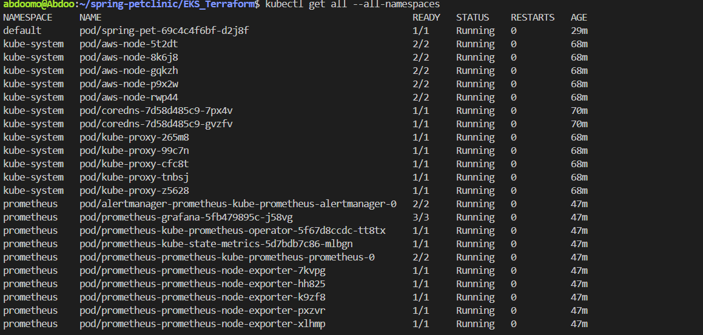
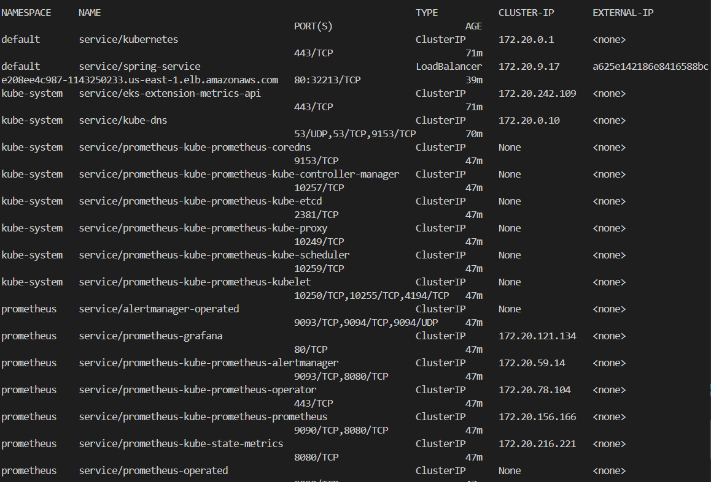
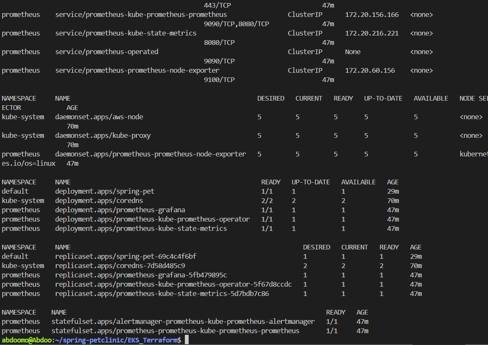
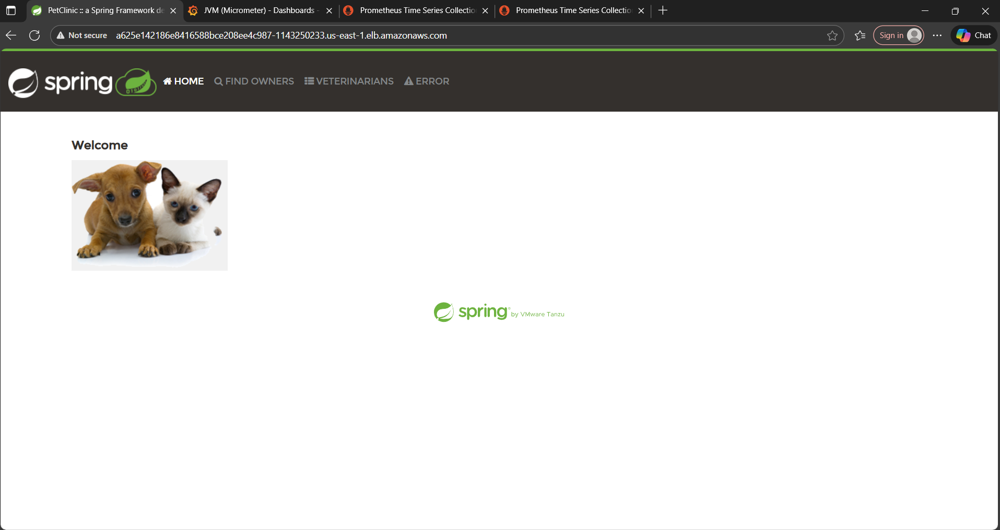
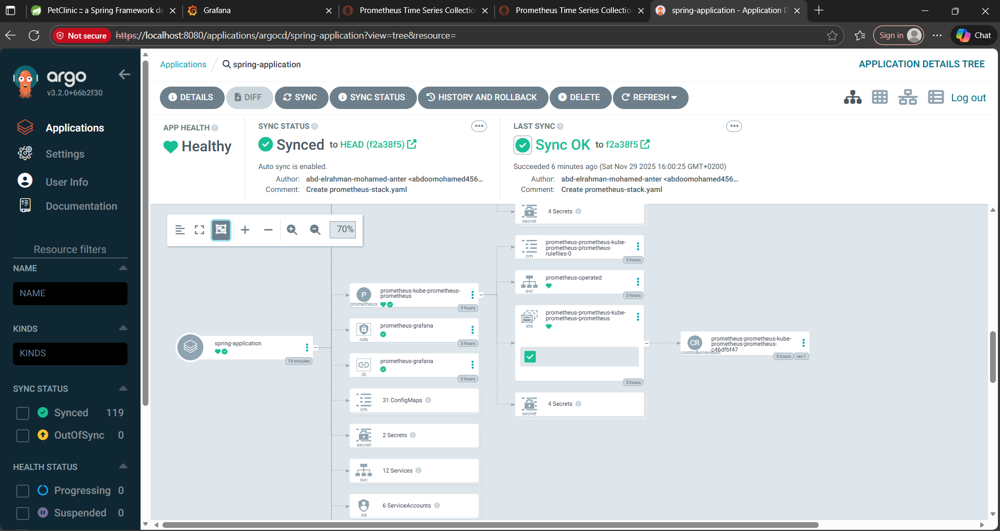
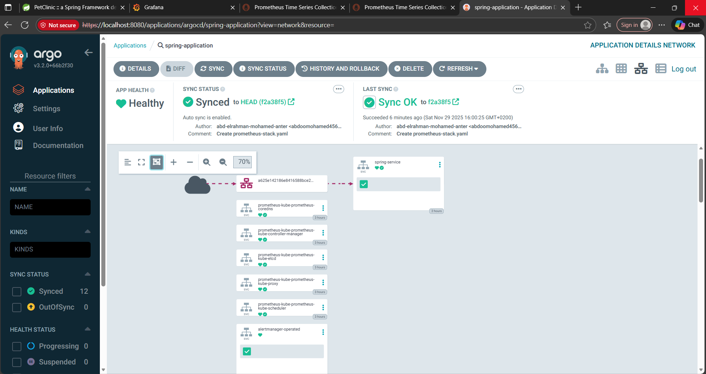
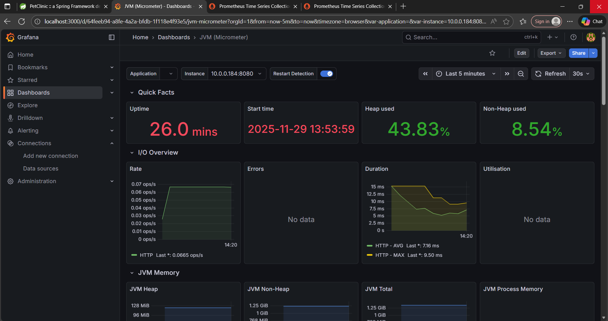
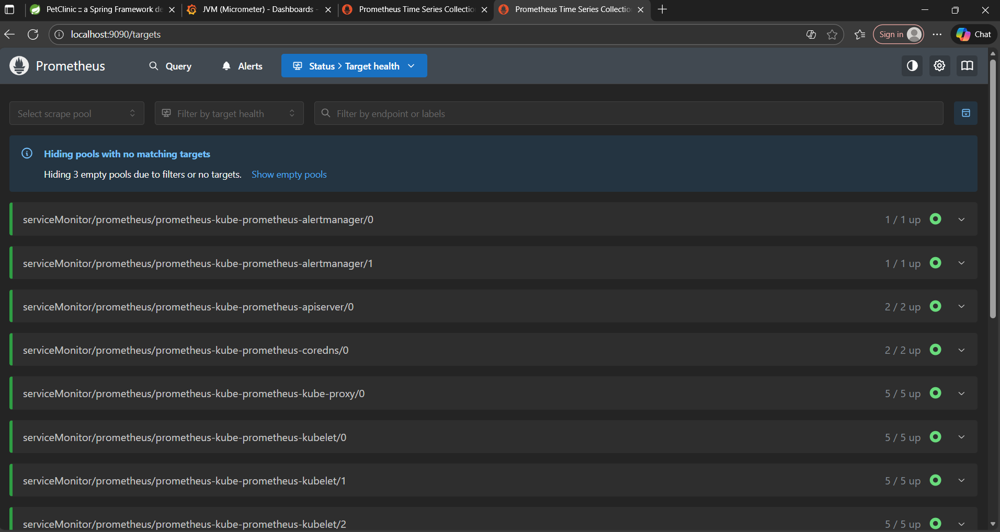
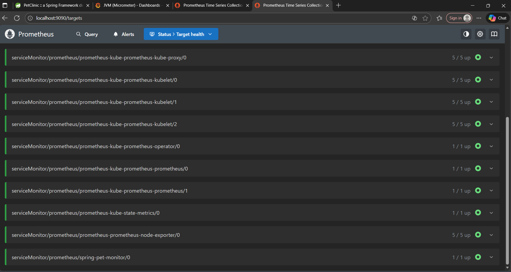
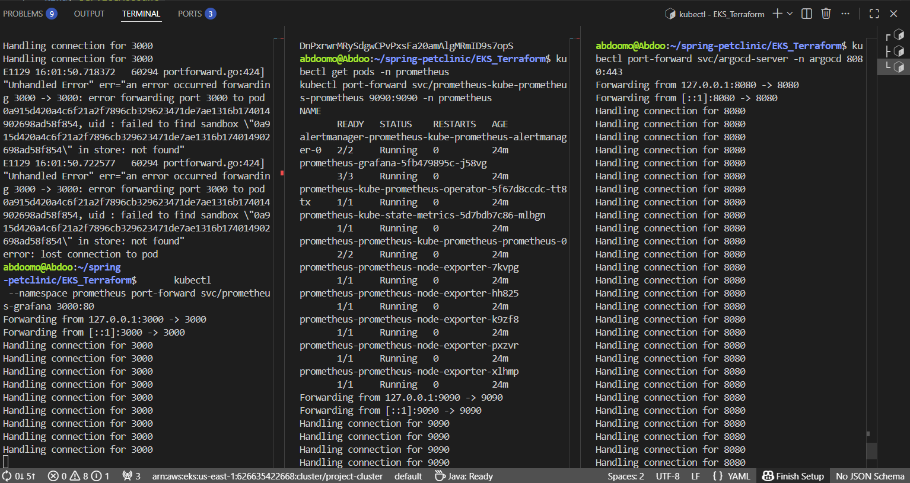

# Spring PetClinic + ArgoCD + Prometheus/Grafana on EKS

This project is a complete setup including:
- **Spring PetClinic Application** (Fullstack Java/Spring Boot)
- **GitOps with ArgoCD** to manage and deploy applications
- **Monitoring** with Prometheus and Grafana
- **Infrastructure as Code** using Terraform to deploy on EKS

---

## 🏗 Architecture

High-level architecture of the project and its resources:






---

## 🐱 Spring PetClinic Application

Application interface after deployment on the cluster:



---

## 🚀 ArgoCD

### ArgoCD Dashboard

ArgoCD dashboard to manage applications:





## 📊 Prometheus & Grafana

### Grafana Dashboard

Monitoring dashboards for the application:



### Prometheus Targets

Current monitoring targets on Prometheus:




---

## 🔌 Port Forwarding

Access services internally via port forwarding:



---

## 🗂 Terraform (EKS)

Infrastructure files are located inside:

```

EKS_Terraform/

````

### Key Files:

- `main.tf` – VPC, Subnets, EKS Cluster configuration
- `deployment.yml` – Spring application Deployment
- `svc.yaml` – Spring application Service
- `prometheus-values.yaml` – Helm values for Prometheus/Grafana
- `spring-servicemonitor.yaml` – ServiceMonitor to monitor Spring app
- `terraform.tfstate` & `terraform.tfstate.backup` – Terraform state (avoid pushing large files to GitHub)

---

## ⚡ Usage

### 1️⃣ Deploy the EKS Cluster with Terraform

```bash
cd EKS_Terraform
terraform init
terraform apply
````

### 2️⃣ Deploy Spring PetClinic

```bash
kubectl apply -f deployment.yml
kubectl apply -f svc.yaml
```

### 3️⃣ Manage Applications with ArgoCD

```bash
argocd login <ARGOCD_SERVER>

# Create and link the application to the repository
argocd app create spring-application \
  --repo <GIT_REPO_URL> \
  --path EKS_Terraform \
  --dest-namespace default \
  --dest-server https://kubernetes.default.svc \
  --sync-policy automated

# Sync the application
argocd app sync spring-application
```

### 4️⃣ Access Grafana and Prometheus

* Via port forwarding:

```bash
kubectl port-forward svc/prometheus-grafana 3000:80 -n prometheus
kubectl port-forward svc/prometheus-kube-prometheus-prometheus 9090:9090 -n prometheus
```

* Then open in browser:

  * Grafana: [http://localhost:3000](http://localhost:3000)
  * Prometheus: [http://localhost:9090](http://localhost:9090)

* Default Grafana password:

```bash
kubectl get secret prometheus-grafana -n prometheus -o jsonpath="{.data.admin-password}" | base64 --decode
```

---

## 🔧 Notes

* **GitHub Repo Structure**:

```
EKS_Terraform/
screens/
README.md
```

* Avoid committing `.terraform/` and `terraform.tfstate` due to size.

* All Kubernetes manifests such as Deployments, Services, ServiceMonitor are inside `EKS_Terraform/`.
